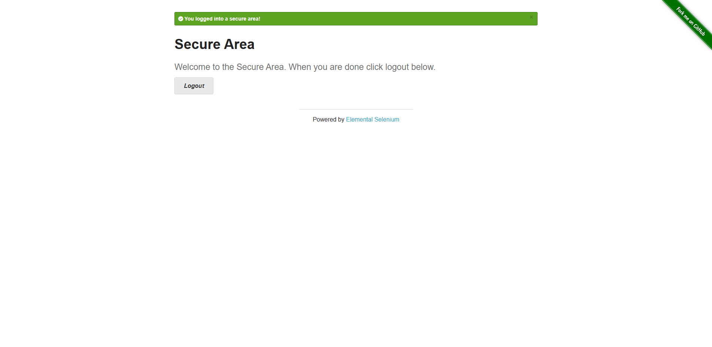
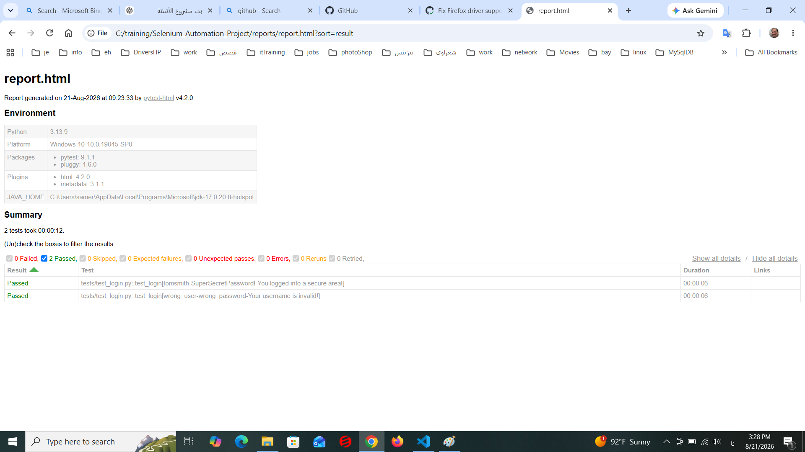
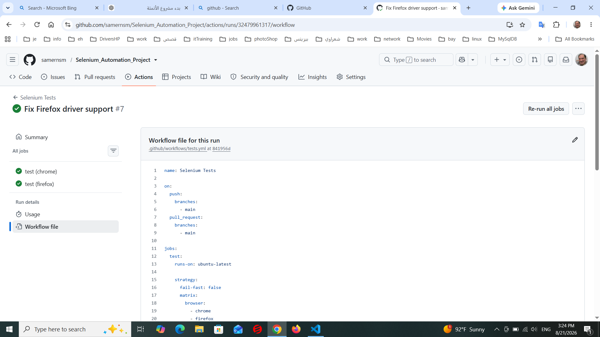

 # Selenium Automation Project

[](https://www.selenium.dev/)
[](https://www.python.org/)
[](https://pytest.org/)
[](https://github.com/samernsm/Selenium_Automation_Project/actions/workflows/tests.yml)
[](https://www.selenium.dev/)

A maintainable **Python Web UI Test Automation Framework** built with **Selenium WebDriver** and **Pytest**.

The project demonstrates practical automation-engineering techniques including **Page Object Model (POM)**, reusable fixtures, explicit waits, data-driven testing, configurable browser execution, cross-browser testing, headless execution, logging, failure screenshots, HTML reporting, and GitHub Actions CI/CD.

---

## 🚀 Features

* Selenium WebDriver
* Chrome browser automation
* Firefox browser automation
* Pytest test framework
* Page Object Model (POM)
* Reusable `BasePage`
* Pytest fixtures
* Explicit waits
* Data-driven testing with `pytest.mark.parametrize`
* Separate test data from test logic
* Driver Factory pattern
* Browser configuration through environment variables
* Headless browser execution
* Automatic screenshots on test failure
* Structured logging
* HTML test reports
* GitHub Actions CI/CD
* Cross-browser CI with Chrome and Firefox
* Git / GitHub integration
* Environment-based configuration

---

## 🧰 Tech Stack

| Technology          | Purpose                |
| ------------------- | ---------------------- |
| **Python 3.13**     | Programming language   |
| **Selenium 4.47.0** | Web browser automation |
| **Pytest 9.1.1**    | Test framework         |
| **pytest-html**     | HTML test reporting    |
| **Chrome**          | Supported browser      |
| **Firefox**         | Supported browser      |
| **GitHub Actions**  | CI/CD automation       |
| **Git / GitHub**    | Version control        |
| **PowerShell**      | Local execution        |

---

## 🏗️ Framework Architecture

```text
                    Selenium Automation Framework
                              │
                    ┌─────────┴─────────┐
                    │                   │
                  Tests              Test Data
                    │                   │
                    ▼                   ▼
              Page Objects        data/login_data.py
                    │
                    ▼
                BasePage
                    │
                    ▼
              Driver Factory
                    │
             ┌──────┴──────┐
             │             │
          Chrome         Firefox
             │             │
             └──────┬──────┘
                    ▼
             Selenium WebDriver
```

---

## 📁 Project Structure

```text
Selenium_Automation_Project/
│
├── .github/
│   └── workflows/
│       └── tests.yml
│
├── config/
│   └── settings.py
│
├── data/
│   └── login_data.py
│
├── pages/
│   ├── base_page.py
│   ├── home_page.py
│   ├── login_page.py
│   └── secure_page.py
│
├── tests/
│   ├── test_login.py
│   └── test_logout.py
│
├── utils/
│   ├── driver_factory.py
│   └── logger.py
│
├── screenshots/
│   └── # Generated failure screenshots
│
├── portfolio_images/
│   ├── failure-screenshot.png
│   ├── github-actions.png
│   └── html-report.png
│
├── logs/
├── reports/
│
├── conftest.py
├── pytest.ini
├── requirements.txt
├── .gitignore
└── README.md
```

---

## 🧪 Test Coverage

The current test suite contains **5 test cases**:

| Test Case             | Description                                             |
| --------------------- | ------------------------------------------------------- |
| `valid_login`         | Verifies successful login with valid credentials        |
| `invalid_credentials` | Verifies login rejection with invalid credentials       |
| `empty_username`      | Verifies validation when username is empty              |
| `empty_password`      | Verifies validation when password is empty              |
| `test_logout`         | Verifies successful logout and return to the Login Page |

### Test Result

```text
5 passed
```

The tests have been successfully executed locally and through GitHub Actions.

---

## 🔄 Data-Driven Testing

Login test data is separated from test logic in:

```text
data/login_data.py
```

The same test function executes multiple scenarios using Pytest parameterization:

```python
@pytest.mark.parametrize(
    "username, password, expected_message",
    LOGIN_TEST_DATA,
)
def test_login(login_page, username, password, expected_message):
    login_page.login(username, password)

    message = login_page.get_flash_message()

    assert expected_message in message
```

This approach reduces duplicated code and makes it easy to add additional test cases.

---

## 🧱 Page Object Model

The framework follows the **Page Object Model** design pattern.

### BasePage

Provides reusable Selenium operations such as:

* Finding visible elements
* Waiting for clickable elements
* Clicking elements
* Entering text
* Reading element text
* Synchronizing with dynamic page changes
* Handling stale element references

### LoginPage

Contains:

* Login locators
* Login actions
* Login-page validation
* Flash-message handling

### SecurePage

Contains:

* Secure-area validation
* Logout action

This separation keeps page-specific behavior out of the test cases and improves maintainability.

---

## 🚗 Driver Factory

Browser creation is centralized in:

```text
utils/driver_factory.py
```

The Driver Factory supports:

```text
Chrome
Firefox
```

Browser selection is controlled through the `BROWSER` environment variable.

### Chrome

```powershell
$env:BROWSER="chrome"
pytest -v
```

### Firefox

```powershell
$env:BROWSER="firefox"
pytest -v
```

---

## 🌐 Cross-Browser Testing

The framework supports:

```text
Chrome   ✅
Firefox  ✅
```

Both browsers have been tested locally and through GitHub Actions.

### Cross-Browser CI

```text
                 GitHub Actions
                       │
             ┌─────────┴─────────┐
             │                   │
          Chrome              Firefox
             │                   │
          5 tests              5 tests
             │                   │
           PASS                PASS
```

---

## 🖥️ Headless Execution

Headless execution is controlled through the `HEADLESS` environment variable.

### Chrome Headless

```powershell
$env:BROWSER="chrome"
$env:HEADLESS="true"
pytest -v
```

### Firefox Headless

```powershell
$env:BROWSER="firefox"
$env:HEADLESS="true"
pytest -v
```

GitHub Actions runs Chrome and Firefox in headless mode.

---

## ⚙️ Configuration

Browser settings are centralized in:

```text
config/settings.py
```

Environment variables are used instead of hard-coding browser execution settings inside the tests.

Example:

```python
BROWSER = os.getenv("BROWSER", "chrome").lower()

HEADLESS = os.getenv(
    "HEADLESS",
    "false",
).lower() == "true"
```

This allows the same test suite to run in different browser configurations without changing the test code.

---

## ⏱️ Explicit Waits

The framework uses Selenium `WebDriverWait` and Expected Conditions instead of fixed `sleep()` calls.

Examples:

```python
EC.visibility_of_element_located(...)
EC.element_to_be_clickable(...)
```

The framework also handles stale element references by re-locating elements when necessary.

This improves synchronization and stability in both local and CI environments.

---

## 📸 Failure Screenshots

When a test fails, the framework automatically captures a screenshot.

Generated screenshots are stored in:

```text
screenshots/
```

A representative failure screenshot is included below:



Generated execution screenshots are excluded from Git through `.gitignore`.

---

## 📝 Logging

The logging implementation is located in:

```text
utils/logger.py
```

Test execution logs are stored in:

```text
logs/test.log
```

Example:

```text
INFO - pages.login_page - Starting login
INFO - pages.login_page - Login button clicked
INFO - pages.login_page - Flash message: You logged into a secure area!
```

Generated log files are excluded from Git.

---

## 📊 HTML Test Reports

The project uses `pytest-html` to generate detailed HTML test reports.

Generate a report with:

```powershell
mkdir reports
pytest -v --html=reports/report.html --self-contained-html
```

The report will be created at:

```text
reports/report.html
```

### HTML Report Example



---

## 🔄 GitHub Actions CI/CD

The project uses **GitHub Actions** to automatically execute the Selenium test suite on:

* Pushes to `main`
* Pull requests targeting `main`

The workflow uses a browser matrix:

```text
                 GitHub Actions
                       │
             ┌─────────┴─────────┐
             │                   │
          Chrome              Firefox
             │                   │
       Headless Mode        Headless Mode
             │                   │
          5 tests              5 tests
             │                   │
           PASS                PASS
```

### CI Pipeline

```text
git push
   ↓
GitHub Actions
   ↓
Checkout repository
   ↓
Set up Python
   ↓
Install dependencies
   ↓
Run Selenium tests
   ↓
Chrome + Firefox
   ↓
Generate HTML reports
   ↓
Upload test artifacts
```

### GitHub Actions Example



---

## 📦 CI Artifacts

The GitHub Actions workflow can upload:

* HTML test reports
* Failure screenshots

These artifacts make failed CI executions easier to investigate.

---

## 🛠️ Installation

Clone the repository:

```powershell
git clone https://github.com/samernsm/Selenium_Automation_Project.git
cd Selenium_Automation_Project
```

Create a virtual environment:

```powershell
python -m venv .venv
```

Activate it on Windows:

```powershell
.venv\Scripts\activate
```

Install dependencies:

```powershell
pip install -r requirements.txt
```

---

## ▶️ Run Tests

Run the complete test suite:

```powershell
pytest -v
```

Expected result:

```text
5 passed
```

---

## 🌐 Run with Chrome

```powershell
$env:BROWSER="chrome"
pytest -v
```

## 🦊 Run with Firefox

```powershell
$env:BROWSER="firefox"
pytest -v
```

## 🖥️ Run Chrome Headless

```powershell
$env:BROWSER="chrome"
$env:HEADLESS="true"
pytest -v
```

## 🦊 Run Firefox Headless

```powershell
$env:BROWSER="firefox"
$env:HEADLESS="true"
pytest -v
```

---

## 🏛️ Architecture

The framework separates responsibilities into several layers:

```text
Tests
  ↓
Page Objects
  ↓
BasePage
  ↓
Driver Factory
  ↓
Selenium WebDriver
  ↓
Chrome / Firefox
```

### Tests

Contains test scenarios and assertions.

### Page Objects

Contains page locators and page-specific actions.

### BasePage

Contains reusable Selenium operations and synchronization logic.

### Fixtures

`conftest.py` manages reusable dependencies such as:

* WebDriver
* `LoginPage`
* `SecurePage`
* Failure screenshot handling

### Test Data

Login data is separated from test logic in:

```text
data/login_data.py
```

---

## 📌 Automation Engineering Practices Demonstrated

This project demonstrates practical automation-engineering concepts including:

* Selenium Web UI automation
* Pytest test design
* Page Object Model
* Reusable fixtures
* Explicit synchronization
* Data-driven testing
* Driver Factory pattern
* Cross-browser testing
* Headless testing
* Logging
* Failure diagnostics
* HTML reporting
* CI/CD with GitHub Actions
* Git / GitHub version control
* Environment-based configuration
* Maintainable automation framework structure

---

## 🚀 Future Improvements

Potential future enhancements include:

* Parallel test execution
* Additional Page Objects
* More authentication and edge-case scenarios
* Test tagging and selective execution
* Allure reporting
* API testing integration
* Docker-based Selenium execution
* Advanced retry handling for selected transient failures

---

## 👤 Author

**Samer Nabil**

GitHub:

https://github.com/samernsm

Repository:

https://github.com/samernsm/Selenium_Automation_Project

---

## 📄 License

This project is intended for learning, demonstration, and portfolio purposes.
